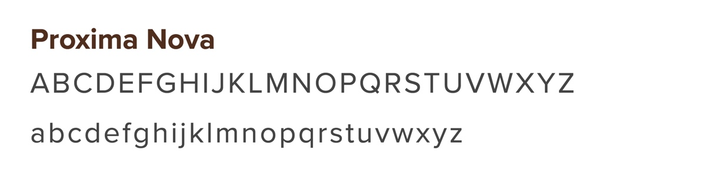
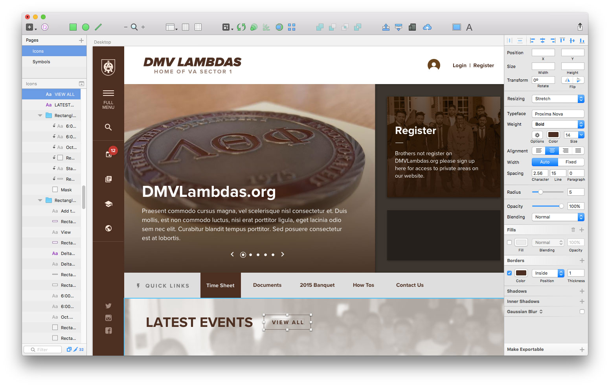
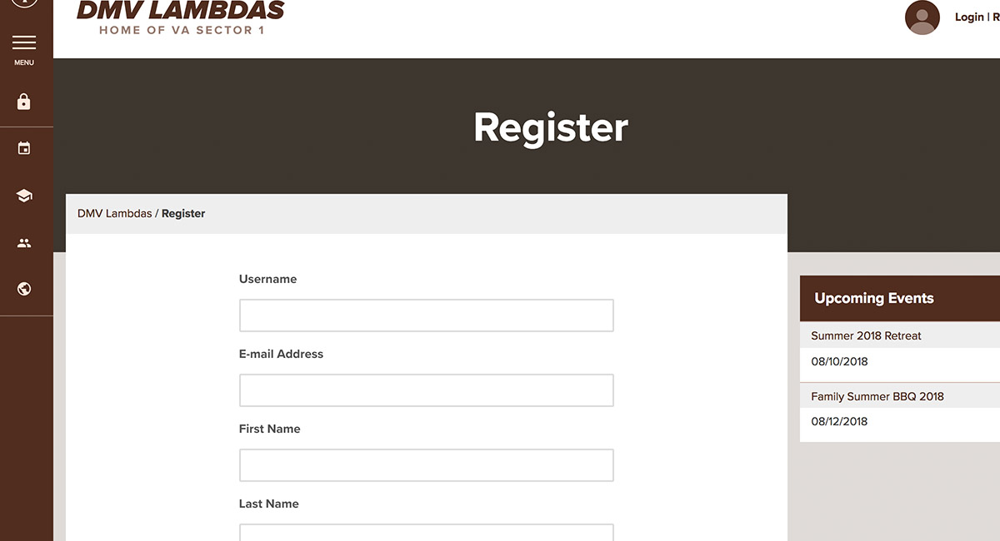
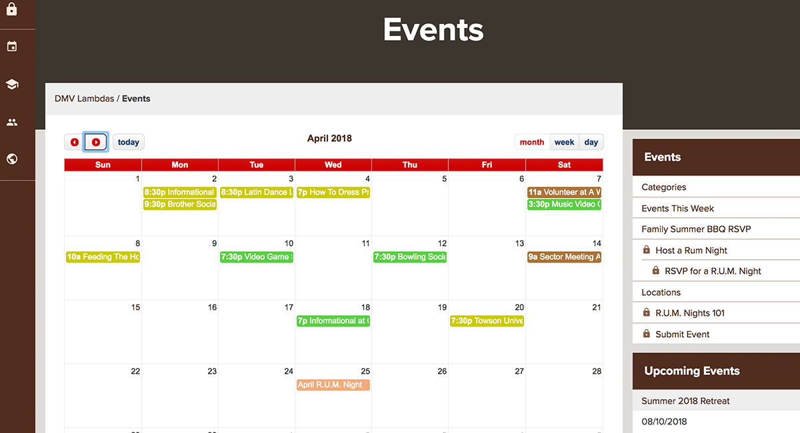
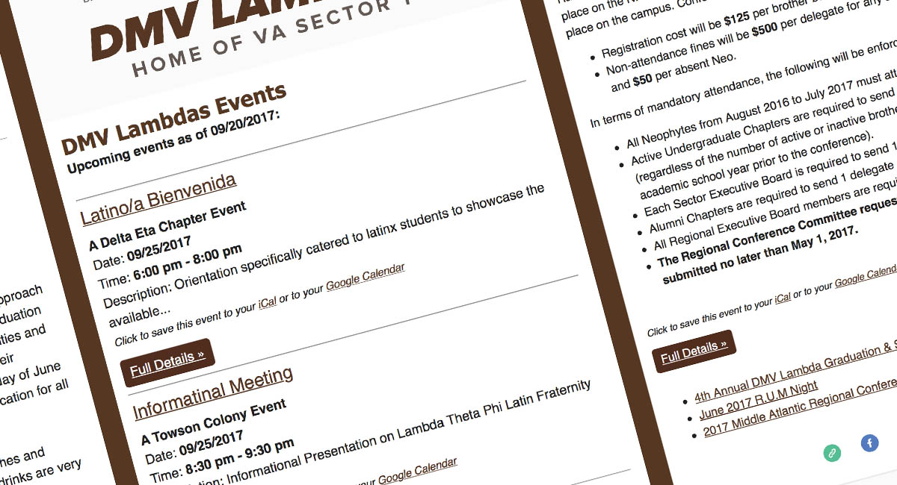

<work-background>

  <strong>DMV Lambdas</strong> or the V.A Sector 1 of Lambda Theta Phi Latin Fraterniy is a non-profit greek organization in the D.C. Area. Together we built a website that in now the center of their commnication strategy. I lead the design, development, and maintence process.

  

    <h5>Modern Design</h5>
    A simple and modern design was created to match the national fraternity's brand.
  

  

    <h5>UX Design</h5>
    Designed for multiple User Profiles found at the Strategy Phase
  

  

    <h5>Responsive Design</h5>
    Fully responsived design to match any screen size
  

</work-background>

<work-styleguide>

  

    
  

  

    

    

    

    

  

  

</work-styleguide>

<work-design color="#502d1e" url="http://www.dmvlambdas.org/">
  <figure type="single">
    
    <figcaption>
      <h5>Fully Custom Design</h5>
    </figcaption>
  </figure>
  <figure type="col">
    
    <figcaption>
	   <h5>Membership Portal</h5>
      Members are allowed to register which allows them access to member-only areas.
    </figcaption>
  </figure>
  <figure type="col">
    
    <figcaption>
      <h5>Member Event</h5>
      Members are allowed add their own events to be shared.
    </figcaption>
  </figure>
  <figure type="col">
    
    <figcaption>
      <h5>Automatic Event Emails</h5>
      Every Sunday, upcoming events uploaded by members are shared to a mailing list.
    </figcaption>
  </figure>
</work-design>
