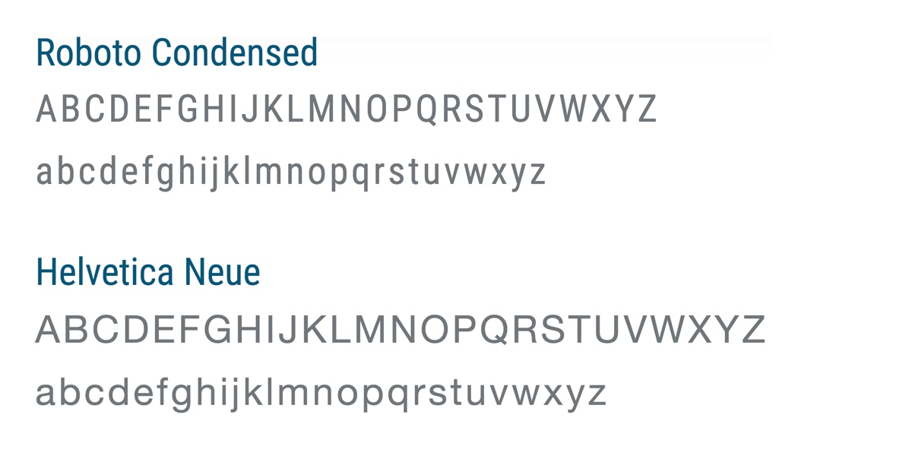
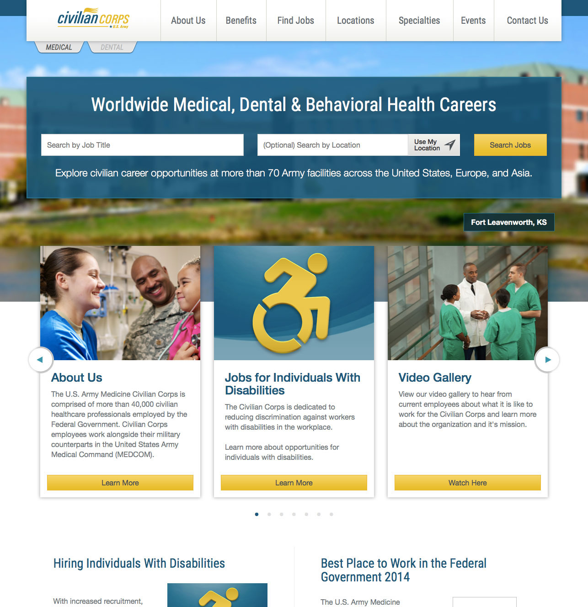
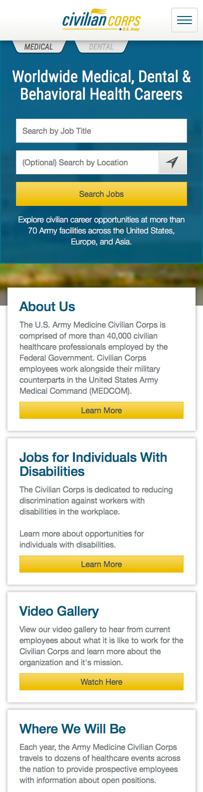

<work-background>

  <strong>U.S. Army Medicine Civilian Corps</strong> recruits civilian healthcare professionals to be employed by the Federal Government, primary under the U.S. Army. As part of an agency, I worked on creating and executing their marketing campaigns between 2014 - 2016. I worked on various large-scale projects, including promotional items, print/online advertisements, and the redesign of their website. I lead the development process on the website redesign project, taking the designers files and building a scalable, compliant, and mobile responsive website.

</work-background>

<work-styleguide>

  

    
  

  

    

    

    

  

</work-styleguide>

<work-design color="#1f607e" url="https://civilianmedicaljobs.com/">
  <figure type="single">
    
    <figcaption>
      <h5>Homepage</h5>
    </figcaption>
  </figure>
  <figure type="col">
    
    <figcaption>
    	<h5>Geo Location Features</h5>
      Search results can be sorted by location
    </figcaption>
  </figure>
  <figure type="col">
    
    <figcaption>
    	<h5>Custom Event Module</h5>
      Built for the CMS of the clients choice
    </figcaption>
  </figure>

</work-design>
