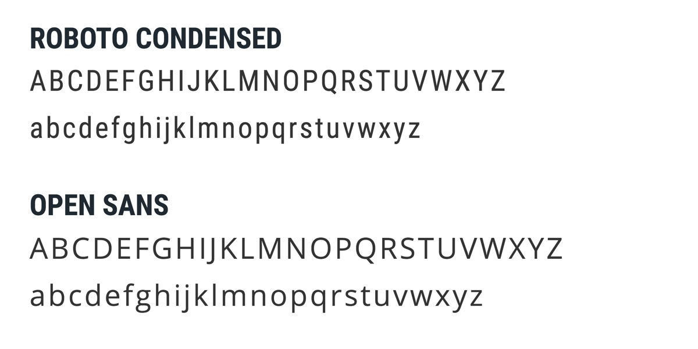
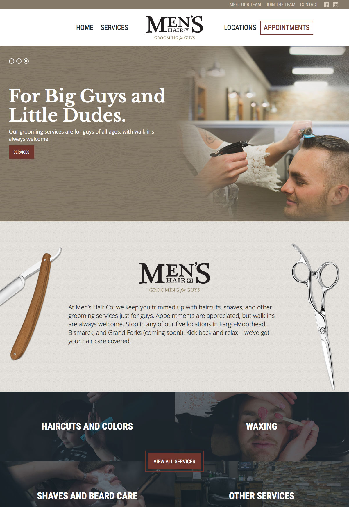
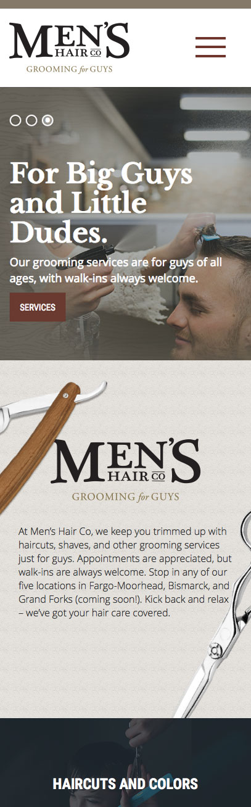

<work-background>

  <strong>Men Hair Co.</strong> a barber shop that specializes in haircuts, shaves, and other grooming services just for guys. A custom branding and website was created to market their new services and new locations.

</work-background>

<work-styleguide>

  

    
  

  

    

    

    

    

  

</work-styleguide>

<work-design color="#1D2931">
  <figure type="single">
    
    <figcaption>
      <h5>Homepage</h5>
    </figcaption>
  </figure>
  <figure type="col">
    
    <figcaption>
      <h5>Instagram</h5>
      Custom Instagram slider
    </figcaption>
  </figure>
  <figure type="col">
    
    <figcaption>
      <h5>Content Editor Features</h5>
      An easy way to add new content
    </figcaption>
  </figure>
</work-design>
