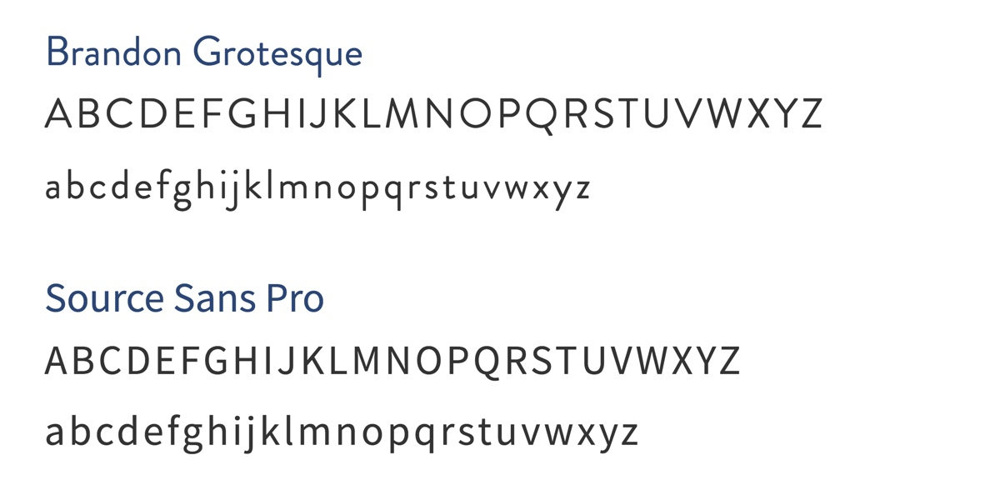
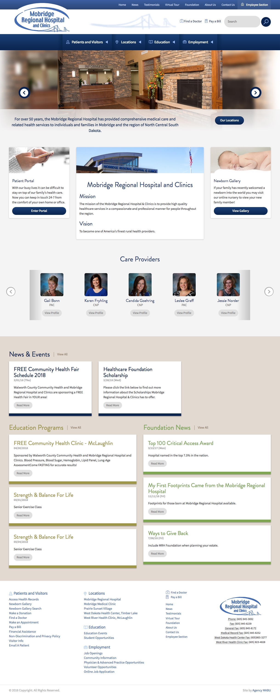
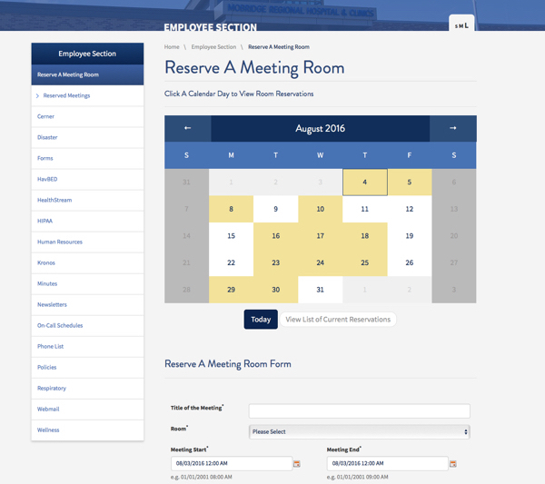
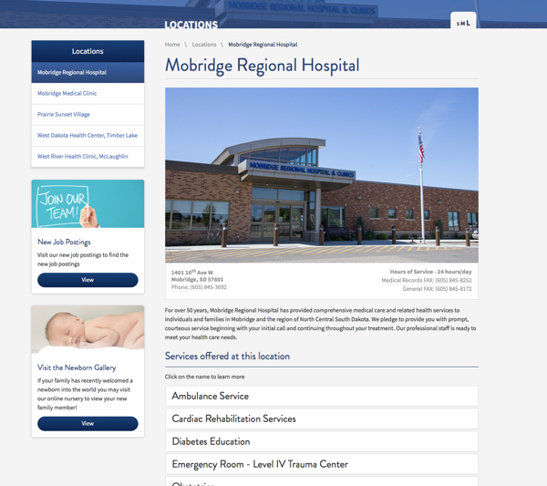

<work-background>

  <strong>Mobridge Hospital</strong> is a Regional Hospital & Clinics that serves a five county area in north central South Dakota, with a population of 17,000 residents. I lead the development process on the website redesign project, taking the designers files and building a scalable, compliant, and mobile responsive website.

</work-background>

<work-styleguide>

  

    
  

  

    

    

    

  

</work-styleguide>

<work-design color="#09254e" url="http://www.mobridgehospital.org/">
  <figure type="single">
    
    <figcaption>
      <h5>Homepage</h5>
    </figcaption>
  </figure>
  <figure type="col">
    
    <figcaption>
      <h5>Meeting Room Module</h5>
    </figcaption>s
  </figure>
  <figure type="col">
    
    <figcaption>
      <h5>About Page</h5>
    </figcaption>
  </figure>
</work-design>
