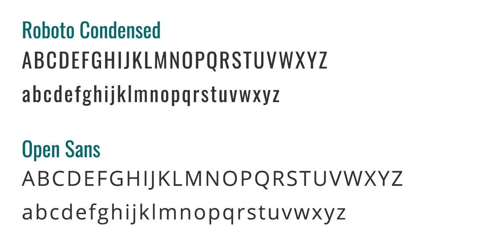
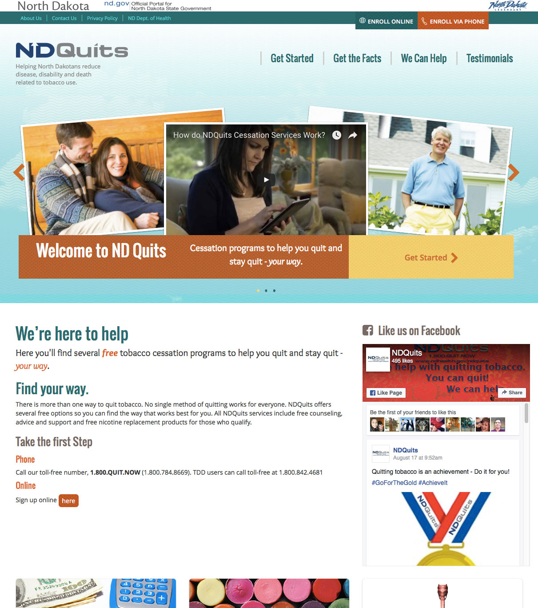
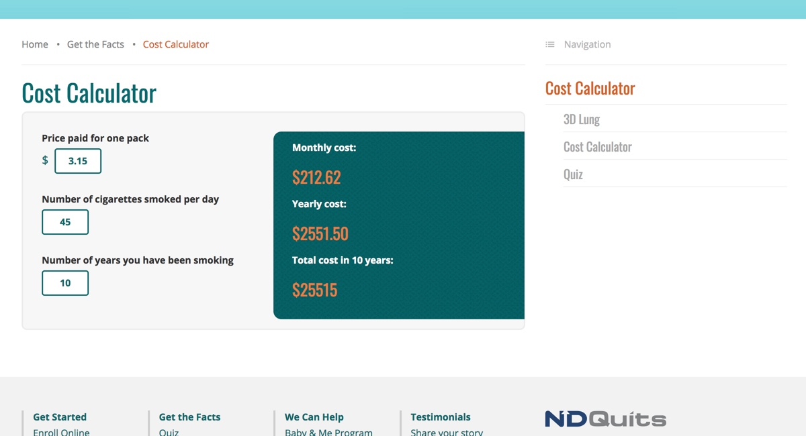

<work-background>

  <strong>ND Quits</strong> is a Division of the North Dakota Department of Health which provides free programs to quit smoking. I worked an agency to redesigned their website into a new modern site.

</work-background>

<work-styleguide>

  

    
  

  

    

    

    

    

  

</work-styleguide>

<work-design color="#036a6e" url="https://ndquits.health.nd.gov/">
  <figure type="single">
    
    <figcaption>
      <h5>Homepage</h5>
    </figcaption>
  </figure>
  <figure type="col">
    
    <figcaption>
      <h5>Quiz Module</h5>
    </figcaption>
  </figure>
  <figure type="col">
    
    <figcaption>
      <h5>Interactive Calculator</h5>
    </figcaption>
  </figure>
</work-design>
