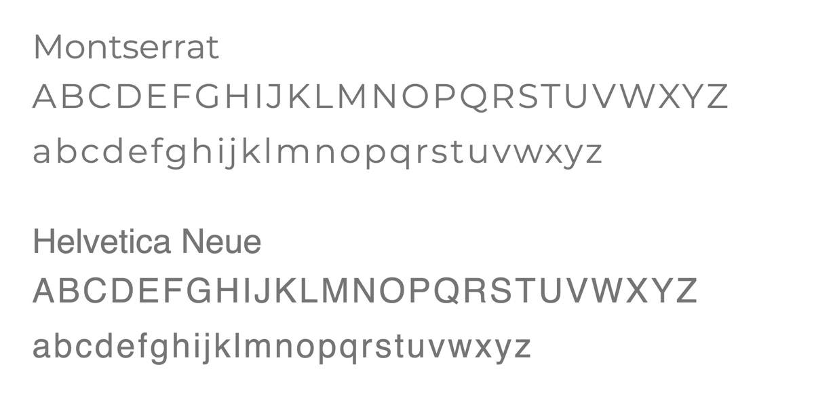

<work-background>

  <strong>PLNR</strong> is a custom calendar web app. The last thing the world needed was another calendar app but I wanted to make something that no other calendar app had. I wanted to solve a missing feature all of the calendar apps I have use (it's been many). Current calendar apps do a great job of placing boxes on your screen that designate your day's activities but none seem to know how those boxes connect to each other. That is where PLNR (pronounced planner) comes in.

</work-background>

<work-styleguide>

  

    
  

  

    

    

    

    

  

</work-styleguide>

<work-design color="#7db859" url="http://plnr.chrisamador.me">
  <figure type="single">
    
    <figcaption>
      <h5>Simple User Interface</h5>
    </figcaption>
  </figure>
  <figure type="col">
    
    <figcaption>
      <h5>Quick Projects Selection</h5>
      Quickly select a previous project or add a new one.
    </figcaption>
  </figure>
  <figure type="col">
    
    <figcaption>
      <h5>Calculate hours</h5>
      Easily see the amount of time you have place into the project before saving.
    </figcaption>
  </figure>

</work-design>
